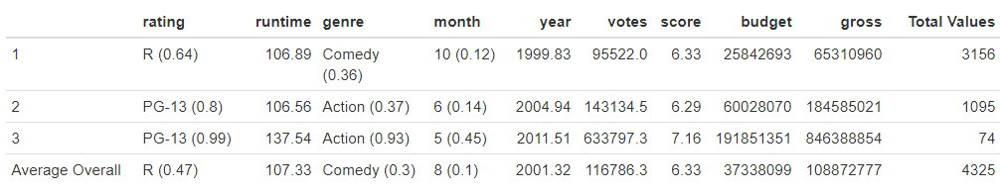
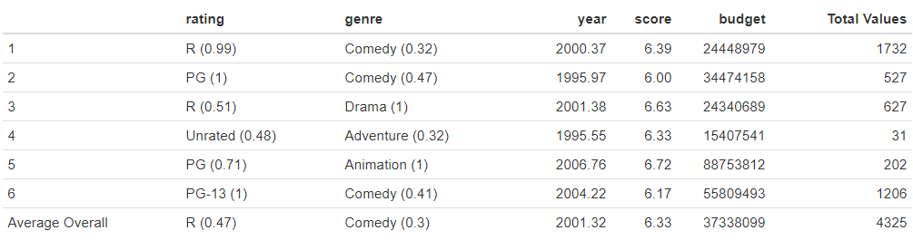

---
```{css, echo =FALSE}

h1.title {
  font-size: 38px;
  color: mediumslateblue;
  text-align: center;
}
h4.author { 
    font-size: 18px;
  font-family: "Times New Roman", Times, serif;
  color: black;
  text-align: center;
}
h4.date { 
  font-size: 18px;
  font-family: "Times New Roman", Times, serif;
  color: black;
  text-align: center;
}
</style>
```

```{r groupContributionsEmails, eval=FALSE, fig.align = 'center', echo=FALSE,warning=FALSE,out.width='70%',out.height='50%'}
knitr::include_graphics("plots/groupmembers.png")
```

# <span style="color: mediumslateblue;">Introduction</span>

It is undeniable that movies and films are one of the most beloved forms of entertainment across the modern world, especially so in the United States as it is the home of Hollywood. The medium of film has grown into a truly massive industry in the United States and film producers risk devastating financial losses and blows to their reputation should a major motion picture be a major flop. As a result, predictions of consumer satisfaction are vital to the success of the industry. An ability to predict how well received a movie will be based on its characteristics or other quantifiable attributes could remove a great deal of the financial risk involved in this industry. Likewise, aggregating movies based on their characteristics may provide new insights into the industry itself.

# <span style="color: mediumslateblue;">Data Description</span>

The data set we set out to investigate was found on Kaggle [@kaggle]: . Originally, the data was scraped from the online movie review and informational website IMDB. There are 7668 movies in the data set from the years 1980 to 2020. Since IMDb are a US-based metric, we decided to eliminate the movies that were not created in the United States in order to hopefully gain a clearer insight into our nation's domestic movie industry. We also decided to remove any rows that contained any NA values. In total, we examined 4325 movies after cleaning the data. See Figure \@ref(fig:dataTable)

The original dataset as pulled from Kaggle contained 15 variables. Ultimately we removed four of them in our cleaning process (`director`, `writer`, `star`, and `company`) and added two of our own (`budget_cat` and `return_prop`). The justification for removing those four variables is described below ("Responding to Comment #2"). Regarding `budget_cat` see Figure \@ref(fig:histBudget) for more detail. Also, we converted a variable in the original data set called `released` which included exact date of release and country of release into just the `month` to see if month was a significant predictor, considering that country of origin had been reduced to the us and `year` was already a variable by itself.

```{r dataTable, fig.cap="Attributes of 'Movie Industry' Data after cleaning", fig.align = 'center', echo=FALSE,warning=FALSE,out.width='50%',out.height='50%'}
knitr::include_graphics("plots/dataTable.png")
```

It is also important to discuss the presence of NAs in this dataset. There were 1150 movies with NAs left over after isolating the data to just the movies labeled as having been produced in the United States (of which there were 5475). There were 3 NAs in `score`, 3 NAs in `votes`, 1099 NAs in `budget`, 98 NAs in `gross`, and 2 NAs in `runtime`. From this breakdown it's clear to see that almost the entirety of the missing values in our data set come from the variable `budget`. We decided to simply remove all of the values that contained at least one NA, since we considered `budget` too important a variable to remove from our analysis.

**Responding to Comment #2:** Our analysis found 1726 unique values of `director`, 2631 unique values of `writer`, 1524 unique values of `star` and 1078 unique values of `company`. Considering that our data set only had 4325 movies after cleaning, we concluded that it would not be possible to use these values in our analysis and hence they were removed from the cleaned data set. There were simply too many unique values to effectively make dummy variables for them in either our regression model or our cluster analysis.

# <span style="color: mediumslateblue;">Research Questions</span>

1. What are the strongest predictors of IMDb score; that is, are there variables that strongly predict if a movie will be well received by audiences? 

2. How can we group movies together that contain similar attributes so that we can recommend similar movies to others?

# <span style="color: mediumslateblue;">Data Visualization</span> {#dv}

```{r histBudget, fig.cap='Histogram of Budget (red dashed line represents division between "low" and "high" budget films)', fig.align = 'center', echo=FALSE,warning=FALSE,out.width='60%',out.height='30%'}
knitr::include_graphics("plots/histBudget.png")
```
Based on the distribution of the Histogram of Budget in figure \@ref(fig:histBudget), we broke down `budget` into two levels: Movies with a budget greater than \$80,000,000 are categorized as “high” budget while those with a budget less than or equal to \$80,000,000 are categorized as “low” budget. These two levels are stored as a factor: `budget_cat`.

```{r yearBudget, eval = FALSE, fig.cap='Boxplot of Year vs Budget', echo=FALSE,warning=FALSE,out.width='100%',out.height='50%'}
# LEGACY
knitr::include_graphics("plots/boxplotYearBudget.png")
```

```{r scoreBudget, eval = FALSE, fig.cap='Boxplot of Score vs Budget', echo=FALSE,warning=FALSE,out.width='100%',out.height='50%'}
# LEGACY
knitr::include_graphics("plots/boxplotScoreBudget.png")
```

```{r bothBox, fig.cap='Boxplot of Year vs. Budget and Boxplot of Score vs. Budget', fig.show = 'hold', fig.align = 'center', echo=FALSE,warning=FALSE,out.width='49%',out.height='50%'}
knitr::include_graphics(c("plots/boxplotYearBudget.png", "plots/boxplotScoreBudget.png"))
```

The distribution for the Boxplot of Year vs Budget in figure \@ref(fig:bothBox)shows that the low budget distribution spans a much longer timespan than high budget movies. The mean year of high budget movies is 2009.117, while the mean year for low budget movies is 2000.333. In looking at the Boxplot of Score vs Budget in figure \@ref(fig:bothBox), we see that the span of distribution is more similar between high and low budget movies, however, the low budget boxplot had far more outliers on the lower end. The mean scores were also more similar between the boxplots, with high budget movies having an average score of 6.579835 and low budget movies having a score of 6.302996. 

```{r scoreVotesCorr, fig.cap='Correlation matrix of Score and Votes', fig.align = 'center', echo=FALSE,warning=FALSE,out.width='50%',out.height='50%'}
knitr::include_graphics("plots/scoreVotesCorr.png")
```
Looking at the correlation between scores and votes in figure \@ref(fig:scoreVotesCorr), we see that the variables have a positive relationship with a correlation coefficient of 0.492 and a normal looking distribution.

**Responding to Comment #1:** We explored the relationship between the number of votes and IMDB score, and ultimately decided to consider movies with all numbers of votes in our predictive model. This is because `votes` does end up being a good indicator of how well received a movie is. Generally, movies with low numbers of votes also have lower scores. Our film with the lowest value for `votes` has $195$ votes and a score of $3.5$. The two movies with the highest values for votes have $2,400,000$ votes and scores of $9.3$ and $9.0$. The mean score for movies with $1,000$ votes or less is $5.3$, while the mean score for movies with at least $500,000$ votes is $7.8$. Votes ended up being one of the most significant predictors in the multiple regression (see Methods/Results), which follows the intuition that if a movie is well-received it will, in general, be part of the public discussion (i.e. voted on).

# <span style="color: mediumslateblue;">Methods and Results</span>

## <span style="color: mediumslateblue;">Multiple Regression</span> {#mr}

To answer our first research question, we implemented a multiple regression linear model to determine if any of the variables in our data set are viable predictors of `score`. We fitted an initial model (named model1) that regressed score on all of the variables depicted in figure \@ref(fig:dataTable) , except for the variable `budget_cat`, which was only created for data exploration purposes. After running the model and analyzing the t-test results via the `summary()` function, we found that while some levels of the variable categorical `genre` are deemed significant predictors of `score` (e.g. `drama`, `animation`), the majority have very high p-values and are not deemed significant predictors (e.g. `thriller`, `mystery`). `Month` is not a significant predictor, nor `gross`, nor `return_prop`.

We then performed a residual analysis on model1. See figure \@ref(fig:residualsPlots) (LEFT). From the Residuals vs. Fitted plot, the residuals are not linear and exhibit heteroskedasticity. The QQ plot suggests that the residuals are not normally distributed, as the lower and higher standardized residuals do not line up with the theoretical quantiles. We also see some outliers, as well as one particularly high leverage point (i.e. observation 2817 (The 2007 movie "Paranormal Activity")).

Next, using a step-wise model selection procedure with $R^2_{adj}$ as a selection criterion, we selected a model that produced the maximum value for $R^2_{adj}$. We chose to use $R^2_{adj}$ as a criterion, rather than $R^2$ because $R^2_{adj}$ is more appropriate for comparing models with different numbers of predictors. $R^2_{adj}$ will only increase for more predictors, if those predictors allow the model to explain more of the variance in the data. This method will implement partial F-tests and then eliminate one-by-one the least significant predictor. In this case, per both backward and forward elimination, the suggested model is `score` ~ `ratingR` + `runtime` + `genreAnimation` + `genreBiography` + `genreDrama` + `genreHorror` + `votes` + `budget`. 

Since only 1 of 8 levels for `rating` is deemed significant, and only 4 of 15 levels for `genre` is deemed significant, we dropped these predictors along with `return_prop`, `gross`, `year` and `month` from the model, thus creating model2. For model2, we found that all the included predictors were significant; however, the residuals exhibited the same issues as those from model1. Since the residuals were nonlinear and heteroskedastic, model2 was a good candidate for a BoxCox transformation. We created and examined a BoxCox plot which had its maximum value near $\lambda = 2$, suggesting we raise $\hat{score}$ to the 2nd power. We fit the new model (model3) as such:


$$\hat{\text{score}} = \sqrt{\hat\beta_0 + \hat\beta_{\text{runtime}} \cdot \text{runtime} + \hat\beta_{\text{votes}} \cdot \text{votes} + \hat\beta_{\text{budget}} \cdot \text{budget}}$$

With model3, our residual plots began to improve and our $R^2_{adj}$ increased. Yet, we had some high leverage points. We removed them from the model, fit a new model, repeated our analysis, found new high leverage points, and removed those as well. At this point, we decided it would be inappropriate to continue to truncate the data. Another BoxCox transformation was implemented and the final model was reached:

$$\hat{\text{score}} = \sqrt[4]{\hat\beta_0 + \hat\beta_{\text{runtime}} \cdot \text{runtime} + \hat\beta_{\text{votes}} \cdot \text{votes} + \hat\beta_{\text{budget}} \cdot \text{budget}}$$

The final model achieves $R^2_{adj} = 0.4844$, which means that if this model is appropriate, the model above explains $48.44\%$ of the variance of `score`. The residual plots of the final model are not perfect but show significant improvement from the initial model. From Figure \@ref(fig:residualsPlots) (RIGHT): linearity was improved, not quite linear but *much* closer. Homoskedasticity appears more likely. Residual quantiles are quite close to theoretical quantiles, and could pass for normality. We conducted formal tests with the following results: Shapiro-Wilk test concluded that our residuals were not normally distributed; Box-Pierce test indicated the residuals were independently distributed; and Breusch-Pagan test concluded the residuals are not quite homoskedastic.

```{r residuals1, eval = FALSE, fig.cap='Residual Plots for Initial Model', echo=FALSE,warning=FALSE,out.width='60%',out.height='70%'}
# LEGACY
knitr::include_graphics("plots/residuals1.png")
```

```{r residualsFinal, eval = FALSE, fig.cap='Residual Plots for Final Model', echo=FALSE,warning=FALSE,out.width='60%',out.height='70%'}
# LEGACY
knitr::include_graphics("plots/residualsFinal.png")
```

```{r residualsPlots, fig.cap='Full model residuals plots (left) and final model residuals plots (right)', fig.show = 'hold', fig.align = 'center', echo=FALSE,warning=FALSE,out.width='49%',out.height='65%'}
knitr::include_graphics(c("plots/residuals1.png", "plots/residualsFinal.png"))
```

## <span style="color: mediumslateblue;">Cluster Analysis</span> {#ca}


To investigate our second research question, we implemented hierarchical clustering methods to group movies together that contain similar attributes so that we can recommend similar movies. This data set contains a large number of categorical variables `rating`, `genre`, and `month` that might be relevant to the aggregation of movies that are alike. As these values are categorical values, a Euclidean distance is not suitable for evaluating the degree of similarity between observations. As a result, we relied on a different distance measure to achieve this classification, known as Gower distance. 

The `daisy()` function with parameter `metric = "gower"` from the package `cluster` computes the Gower's distance (as a dissimilarity object) between units in a data set or between observations in two distinct data sets. It is useful in cases where records contain combinations of logical, numerical, categorical or text data. [@cluster] We used this method to create hierarchical clusters, and plot dendrogram of the results (Figure \@ref(fig:dendPlots)).

The Full Hierarchical Clustering in figure \@ref(fig:dendPlots) (RIGHT) is the full clustering with all the variables (except `budget_cat` since we used `budget` and did not want to essentially reference the same variable twice). An additional cluster model was created by removing some of the variables that likely would not have as significant an impact on how the consumer perceived a film. This emphasized some of the qualitative aspects. The result of this Reduced Variable Clustering in figure \@ref(fig:dendPlots) (LEFT) only has the variables `rating`, `genre`, `year`, `score`, and `budget`. The Reduced Variable Hierarchical Clustering ended up with 6 relatively clearly defined categories (dark blue line visualizes cut of dendrogram), while the Full Clustering had 3 primary clusters.

```{r dendPlots, fig.cap='Colored dendrogram plots of full and reduced variable hierarchial clustering', fig.show = 'hold', fig.align = 'center', echo=FALSE,warning=FALSE,out.width='49%',out.height='65%'}
knitr::include_graphics(c("plots/dend1.png", "plots/dend2.png"))
```

Cutting and returning the list of movies in the each of the clusters of both dendrograms allows us to view the titles of the movies in those clusters. By doing this we are able to visually see the groupings by movie name and infer how they may be clustered differently based on which variables are included in the model. To further explore where these difference may be coming from, we created a function that returned a data frame (displayed as a table with `knitr`) with the means of numeric variables and the most frequent value and proportion of that value of categorical variables in each cluster of the Full Hierarchical Clustering model and the Reduced Variables Hierarchical Clustering models. The function also returns the total number of values in each of the clusters.

```{r fullhclustMeans, fig.cap='Mean and Proportions of Full Hierarchial Clustering', fig.show = 'hold', fig.align = 'center', echo=FALSE,warning=FALSE,out.width='90%',out.height='65%'}

```

<br></br>

```{r reducedhclustMeans, fig.cap='Mean and Proportions of Reduced Hierarchial Clustering', fig.show = 'hold', fig.align = 'center', echo=FALSE,warning=FALSE,out.width='90%',out.height='65%'}

``` 

Including the number of values allows us to associate cluster numbers to the plots above. 

The most interesting finding within the full cluster analysis is the significant difference between the red clustering on the Full Clustering plot and the other two clusters on that same plot. This small cluster of 74 observations (labelled Cluster 3 in Figure \@ref(fig:fullhclustMeans)). These represent newer, higher budget, action films, commonly rated PG-13. Investigating which movies belong to this cluster, we find "Avatar", "Avengers: Age of Ultron", some of the Star Wars films, etc. Clearly this cluster is a really dense group of very similar, high budget, high grossing, more highly rated films. These are a very specific aggregation of "action blockbuster" films.

The second cluster analysis on reduced variables resulted in six clusters of far more meaningful differences on a consumer level. In a similar way to the "action blockbuster" films described in the previous paragraph, many of the clusters aggregated in a way that can be defined as a phrase to a prospective consumer. Cluster 5 in Figure \@ref(fig:reducedhclustMeans (light blue in the Reduced Variable Dendrogram) for instance contains almost entirely animated films for children which included Disney movies such as "The Lion King" and "Mulan."

# <span style="color: mediumslateblue;">Discussion and Conclusion</span> {#dc}

**Multiple Regression:**
One of the main issues we encountered with every multiple regression model were the high-leverage points. Upon closer inspection of the films that constituted the high-leverage points, we gained some insight into the predictive capabilities of the data set. The movies in the data set with high leverage included: Pulp Fiction, The Dark Knight, The Shawshank Redemption, The Matrix, Forrest Gump, and Inception. Even those who are not avid movie enthusiasts should recognize some of (if not all) the iconic films within this list. 

What our model struggles to predict are those super-hit classic films that have so much influence within the world of entertainment. However, a regression model may give us an idea of IMDB score for average, run-of-the-mill films, based on factors such as budget, number of votes, and runtime. This suggests there are other layers to the art of film-making not quantified in this data set. For instance, other movie metrics such as script quality, actor performance, cinematography, and/or novelty could play a significant role, but these were not captured in the data set that we used 

Our findings suggest these underrepresented qualities are important to the public's perception of films, but needless to say, they may be difficult measures to capture. Perhaps this is why they call it "movie magic!" 

**Hierarchical Clustering:** 
To explore grouping movies with similar attributes together we needed to perform hierarchical clustering using the `daisy()` function with parameter `metric = "gower"`. Our initial issue was attempting to use Euclidean distance to create the clusters. This proved ineffective due to the categorical variables. By using the Gower distance function we were able to work around this and create hierarchical clusters for a the full set of variables and a reduced set of variables. 

We created a function to analyze the mean and proportions of each variable that made up the clusters of each model to explore if the clusters were actually grouping movies with similar attributes together, and to investigate how the clusters differed from one another. Looking at the proportions in particular, we saw that the reduced model had particularly high proportions for `rating` in certain clusters, as well as in `genre`. This is ultimately intuitive as in the presence of fewer variables, these variables had a larger impact on the aggregation of our clusters.

In the Full Hierarchical Clustering model, after returning the list of movies in the red cluster, we can see the movie titles included: Iron Man, Spider-Man: Homecoming, and Wonder Woman. These movies definitely have similarities and would definitely be recommended if any movie was selected first and does correlate with the means and proportions we gathered from our function. However, despite the proportions for variables being higher in the Reduced Variable Hierarchical Clustering model, the movie title list returned from the first cluster has much more variability, for example "The Proposal", a romantic comedy, is being recommended in the same category as "The Twilight Saga: Eclipse", a fantasy movie. This suggests that aside from the "action blockbusters" category that was investigated above, our full model had too much noise to be very effective at establishing meaningful clusters.

# <span style="color: mediumslateblue;">References</span> {#bib}

<div id="refs"></div>

# Authors and Contributions

**Riley Adams:** Riley was a main collaborator in the overall planning and conceptual direction of the study. He contributed to data exploration, and data cleaning, including collaborating on the code written. He produced figures \@ref(fig:histBudget) , \@ref(fig:bothBox), \@ref(fig:scoreVotesCorr) , and \@ref(fig:residualsPlots) . He also took the lead on implementation of the Section \@ref(mr), writing all the code involved. He also was the main contributor for the write up of Section \@ref(mr) as well as the "multiple regression" portion of Section \@ref(dc) and "Responding to comment #1" in Section \@ref(dv) . He also implemented the formatting and production of the final document through the "bookdown" library in the R programming language, and creation Section \@ref(bib). 

email: rtadams@ucdavis.edu

**Jordan Bowman:** Jordan was a main collaborator in the overall planning and conceptual direction of the study. He contributed to data cleaning, and data exploration, including collaborating on the code written. He produced figures \@ref(fig:scoreVotesCorr) and \@ref(fig:dendPlots) and took the lead on implementation of Section \@ref(ca) , (writing all the code involved, including the `means_by_cluster()` function) and "Responding to Comment #2" in Section \@ref(dv) . He was the primary contributor to the Data Description and also contributed to the write-up of of Section \@ref(ca) .

email: jorbowman@ucdavis.edu

**Ruqayyah Siddique:**

email: rfsiddique@ucdavis.edu

**Constanza Widel:** Constanza contributed in Cluster Analysis and interpreting the tables produced by the function. She also contributed to the Data Visualization section and Hierarchial Clustering section of the conclusion. 

email: cwidel@ucdavis.edu

**Tracy Yu:** Tracy contributed in assisting in the creation of the Introduction and in the editing of the final document. She collaborated to produce a final draft for section \@ref(mr) and the "multiple regression" portion of Section \@ref(dc)

email: trayu@ucdavis.edu

# (APPENDIX) Code Appendix {-}

## Libraries

```{r,eval=FALSE}
require(dplyr)
require(ggplot2)
require(GGally)
require(lmtest)
require(car)
require(leaps)
require(MASS)
require(cluster)
require(dendextend)
require(readr)
```

## Data Cleaning / Exploration

```{r, eval=FALSE}
movies_original <- read.csv("movies.csv")
dim(movies_original)

# Remove rows containing NA
movies <- movies_original[rowSums(is.na(movies_original)) == 0,]

# Create "month" using "released"
# A factor 1:12, indicating month of release
month <- numeric()

for (i in 1:length(movies$released)){
  if (grepl("January", movies$released[i])){
    month[i] <- 1
  }else if (grepl("February", movies$released[i])){
    month[i] <- 2
  }else if (grepl("March", movies$released[i])){
    month[i] <- 3
  }else if (grepl("April", movies$released[i])){
    month[i] <- 4
  }else if (grepl("May", movies$released[i])){
    month[i] <- 5
  }else if (grepl("June", movies$released[i])){
    month[i] <- 6
  }else if (grepl("July", movies$released[i])){
    month[i] <- 7
  }else if (grepl("August", movies$released[i])){
    month[i] <- 8
  }else if (grepl("September", movies$released[i])){
    month[i] <- 9
  }else if (grepl("October", movies$released[i])){
    month[i] <- 10
  }else if (grepl("November", movies$released[i])){
    month[i] <- 11
  }else{
    month[i] <- 12
  }
}

movies <- cbind(movies, month)
movies$month <- as.factor(movies$month)

# Here we can see almost 80% of the movies are from the US
# Considering IMDb is a US-based database, isolate to the US only
# sum(movies$country == "United States")/dim(movies)[1]
movies <- movies[movies$country == "United States",]

# remove variable we will not be using
drops <- c("released","director","writer","star","company")
movies <- movies[, !(names(movies) %in% drops)]
rownames(movies) <- 1:nrow(movies)
  
# Reorganize columns
organized <- c("name", "rating", "runtime", "genre", "month", "year", "votes", "score", "budget", "gross")
movies <- movies[, organized]

# Create variable for gross/budget
return_prop <-  movies$gross / movies$budget
movies <- cbind(movies, return_prop)

# All movies with blank rating were rated R
for (i in 1:nrow(movies)){
  if(movies$rating[i] == "")
    movies$rating[i] <- "R"
}

# Combine "Unrated" to "Not Rated" -> "Unrated"
for (i in 1:nrow(movies)){
  if(movies$rating[i] == "Not Rated")
    movies$rating[i] <- "Unrated"
}

movies_hold <- movies

#check for NAs
movies_test <- movies_original[movies_original$country == "United States",]

# number of NAs
sum(rowSums(is.na(movies_test)) != 0)

# count NAs by variable
NAS_var <- colSums(is.na(movies_test))
NAS_var <- NAS_var[NAS_var != 0]

ggpairs(movies[,-1])

hist(movies$budget, labels = TRUE,breaks = 18)
#cut at bin before 1.0e+08
mov_hist <- hist(movies$budget, labels = TRUE,breaks = 18)
budget_cat <- character()
for(i in 1:nrow(movies)){
  if (movies$budget[i] > mov_hist$breaks[5]){
    budget_cat[i] <- "high"
  }else{
    budget_cat[i] <- "low"
  }
}
movies <- cbind(movies, budget_cat)
movies$budget_cat <- as.factor(budget_cat)
#calculate percentage of movies with high budget
(159+78+65+67+44+40+9+7+9+3+2+1+1+1)/nrow(movies)
# run average release year, check overall distribution of year
mean(movies$year[movies$budget_cat == "low"])
mean(movies$year[movies$budget_cat == "high"])
# check average score between two groups (high budget/low budget)
mean(movies$score[movies$budget_cat == "low"])
mean(movies$score[movies$budget_cat == "high"])

# ~~~~~ Responding to Q1 ~~~~~
ggpairs(movies[c("score", "votes")])
# From chart we see that the correlation is extremely significant. 
var(movies$votes)
# From above note extremely high variability
movies_q1_1 <- movies[movies$votes >= 200000,]
ggpairs(movies_q1_1[c("score", "votes")])

mean(movies$score)

mean_q1_2 <- movies[movies$votes <= 1000,]
mean(mean_q1_2$score)
mean_q1_3 <- movies[movies$votes >= 500000,]
mean(mean_q1_3$score)

# ~~~~~ Responding to Q2 ~~~~~
length(unique(movies))
```

## Regression

```{r,eval=FALSE}
# ~~~~~ MODEL 1 ~~~~~
# fit model and summary output
model1 <- lm(formula = score ~ rating + runtime + genre + month + year + votes + budget + gross + return_prop , data = movies)
summary(model1)
# residual analysis
par(mfrow=c(2,2))
plot(model1)
par(mfrow=c(1,1))
# Model Selection

## Forward selection 
model1_forward <- regsubsets(score ~ rating + runtime + genre + month + year + votes + budget + gross + return_prop, 
                           data = movies, method = "forward")
cbind(summary(model1_forward)$which, "adjusted r^2" = summary(model1_forward)$adjr2)

## Backward selection 
model1_backward <- regsubsets(score ~ rating + runtime + genre + month + year + votes + budget + gross + return_prop, 
                           data = movies, method = "backward")
cbind(summary(model1_backward)$which, "adjusted r^2" = summary(model1_backward)$adjr2)

# ~~~~~ MODEL 2 ~~~~~~~~~
# fit model and summary output
model2 <- lm(formula = score ~ runtime + votes + budget, data = movies)
summary(model2)
# residual analysis
par(mfrow=c(2,2))
plot(model2)
par(mfrow=c(1,1))
# ~~~~ BoxCox Transformation ~~~~~~
# Boxcox for model2
boxcox(model2)

# ~~~~~ MODEL 3 ~~~~~~~~~
# square outcome variable (score)
score_sq <- (movies$score)^2
# fit model and summary output
model3 <- lm(formula = score_sq ~ runtime + votes + budget, data = movies)
summary(model3)
# residual analysis
plot(model3)

# ~~~~~ MODEL 4 ~~~~~~~~~

# create vector containing highest leverage points.
# (Pulp Fiction, The Dark Knight, The Shawshank Redemption)
highlev <- c(1148,2889,1147)
movies[highlev,]

# new dataframe without high leverage points
movies_lowlev <- movies[-highlev,]
rownames(movies_lowlev) <- 1:nrow(movies_lowlev)

# have to remove same values in score_sq
score_sq_ll <- score_sq[-highlev]

# fit model and summary output
model4 <- lm(formula = score_sq_ll ~ runtime + votes + budget, data = movies_lowlev)
summary(model4)
# residual analysis
plot(model4)
# high leverage
hl_2 <- c(1741,1147,3149)
movies_lowlev[hl_2,]
# seems like the movies that keep throwing off the model are those that are "big hits" or "classics"

# ~~~~~ MODEL 5 ~~~~~~~~~

# new dataframe without high leverage points
movies_lowlev2 <- movies_lowlev[-hl_2,]
rownames(movies_lowlev2) <- 1:nrow(movies_lowlev2)

# have to remove same values in score_sq_ll
score_sq_ll2 <- score_sq_ll[-hl_2]

# fit model and summary output
model5 <- lm(formula = score_sq_ll2 ~ runtime + votes + budget, data = movies_lowlev2)
summary(model5)
# residual analysis
plot(model5)
# high leverage
hl_3 <- c(3409,3668,1256)
movies_lowlev2[hl_3,]

boxcox(model5)

# ~~~~~ MODEL 6 ~~~~~~~~~
score_4th <- (score_sq_ll2)^2

# fit model and summary output
model6 <- lm(formula = score_4th ~ runtime + votes + budget, data = movies_lowlev2)
summary(model6)
# residual analysis
plot(model6)

# ~~~~~~~~ Residual Analysis: Formal Tests ~~~~~~~~

# Shapiro-Wilk Test
# test for normality
# H0: data are normally distributed
shapiro.test(resid(model6))
# we reject the null, so the residuals are not normal

# Box-Pierce Test
# test for correlated errors
# H0: The residuals are independently distributed
Box.test(model6$residuals)
# We reject the null, the residuals are independently distributed

# Breusch-Pagan Test
# test for homoskedasticity
# H0: the errors are homoskedastic
bptest(model6)
# We reject the null, the residuals are heteroskedastic (non constant variance)
```

## Cluster Analysis

```{r,eval=FALSE}
# Gower dist: https://arxiv.org/ftp/arxiv/papers/2101/2101.02481.pdf
movies_clust <- movies_hold[c(-1,-11)]
movies_clust$rating <- as.factor(movies_clust$rating)
movies_clust$genre <- as.factor(movies_clust$genre)
movies_clust$month <- as.factor(movies_clust$month)

gow_dist_full <- daisy(movies_clust, metric = "gower")
gow_full_hclust <- hclust(gow_dist_full)
cut_gow_full_hclust <- cutree(gow_full_hclust, k = 3)
dend_full <- as.dendrogram(gow_full_hclust)
dend_full <- color_branches(dend_full, k = 3)
plot(dend_full, main = "Full Hierarchical Clustering")
movies[cut_gow_full_hclust == 3, 1]

gow_dist_intuitive <- daisy(movies_clust[c(1, 3, 5, 7, 8)], metric = "gower")
gow_intuitive_hclust <- hclust(gow_dist_intuitive)
cut_gow_intuitive_hclust <- cutree(gow_intuitive_hclust, k = 6)
dend_intuitive <- as.dendrogram(gow_intuitive_hclust)
dend_intuitive <- color_branches(dend_intuitive, k = 6)
plot(dend_intuitive, main = "Reduced Variable Hierarchical Clustering", sub = "Rating, Genre, Year, Score, and Budget")
abline(h = 0.72, col = "darkblue")
movies[cut_gow_intuitive_hclust == 6, 1]

# ~~~~function~~~~
means_by_cluster <- function(cut_hclust, df){
  # set up return object
  center_df <- as.data.frame(matrix(NA, nrow = (max(unique(cut_hclust)) + 1), ncol = (dim(df)[2] + 1)))
  colnames(center_df) <- c(names(df), "Total Values")
  rownames(center_df) <- c(unique(cut_hclust), "Average Overall")
  
  # iterate through the clusters and overall average
  for(i in 1:(max(unique(cut_hclust)) + 1)){
    if(i == (max(unique(cut_hclust)) + 1)){
      subset_df <- df
    }else{
      subset_df <- df[cut_hclust == i,]
    }
    
    # iterate through each column for measure of center
    for(j in 1:dim(subset_df)[2]){
      center <- NA
      
      if(is.numeric(subset_df[,j])){
        # when numeric, use mean
        center <- round(mean(subset_df[,j]), digits = 2)
        
      }else{
        # when categorical, use most frequent value and give proportion of that value
        center <- names(tail(sort(table(subset_df[,j])), 1))
        prop <- round(tail(sort(table(subset_df[,j])), 1) / length(subset_df[,j]),
                      digits = 2)
        
        center <- paste(center, " ", "(", prop ,")", sep = "")
      }
      
      center_df[i, j] <- center
    }
    
    center_df[i, dim(center_df)[2]] <- dim(subset_df)[1]
  }
  
  return(center_df)
}

# make into tables
knitr::kable(means_by_cluster(cut_gow_full_hclust, movies_clust))
knitr::kable(means_by_cluster(cut_gow_intuitive_hclust, movies_clust[c(1, 3, 5, 7, 8)]))
```

## Plots
```{r,eval=FALSE}
# import cleaned data
moviesClean <- read_csv("moviesClean")

# scale budget
budget_scale <- moviesClean$budget / (10^6)

# define histogram object for budget
budg_hist <-  hist(budget_scale,
                   col = 'lightblue',
                   labels = TRUE,
                   breaks = 18,
                   main = "Frequency of Movies by Budget",
                   xlab = "Budget (Millions of USD)")

# define tick marks at bin deliniations
ticks <- numeric()
for (i in 1:length(budg_hist$breaks)){
  ticks[i] <- budg_hist$breaks[i]
}
  

# output histogram for budget
hist(budget_scale,
     col = 'lightblue',
     labels = TRUE,
     breaks = 18,
     main = "Frequency of Movies by Budget",
     xlab = "Budget (Millions of USD)",
     xaxt = "n")
axis(1, at = ticks)
abline(v = budg_hist$breaks[5],
       col = "red",
       lwd=3,
       lty = 2)
text(x=50,y=1500,"Low Budget")
text(x=50,y=1400,"88.76%")
text(x=115,y=1500,"High Budget")
text(x=115,y=1400,"11.24%")

# boxplot for budget levels high and low with year
boxplot(year ~ budget_cat, 
        data = moviesClean, 
        main = "Distribution of Year Released for High Budget and Low Budget Movies",
        xlab = 'Budget',
        ylab = 'Year Released',
        col = c('coral2', 'cornflowerblue'),
        horizontal = TRUE)
legend("left", 
       inset = 0.006,
       cex = 1.5,
       title = "Budget",
       c("> $80 million", "< $80 million"),
       fill = c('coral2', 'cornflowerblue'))

# boxplot for budget levels high and low with score
boxplot(score ~ budget_cat, 
        data = moviesClean, 
        main = "Distribution of IMDB Score for High Budget and Low Budget Movies",
        xlab = 'Budget',
        ylab = 'Score',
        col = c('coral2', 'cornflowerblue'),
        horizontal = TRUE)
legend("left", 
       inset = 0.006,
       cex = 1.5,
       title = "Budget",
       c("> $80 million", "< $80 million"),
       fill = c('coral2', 'cornflowerblue'))
```
